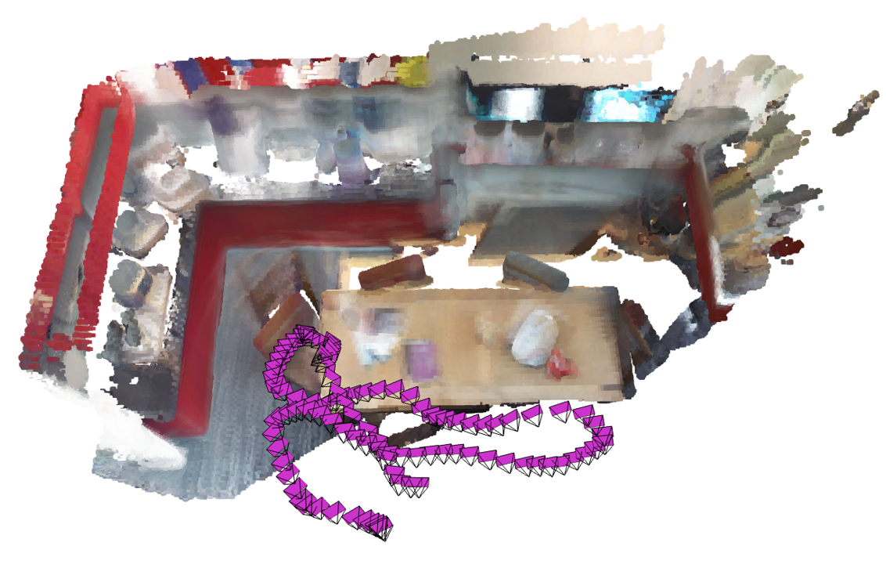

# TSDF Fusion given Camera Parameters and RGB-D Images

This repo is to demonstrate how to fuse a set of registered RGB-D images into a truncated signed distance function
(TSDF) volume. Here TSDF volume is one kind of implicit representation for surface or shape which can be used to create other explicit representations (for example, point-cloud and mesh) through marching cubes method. In the data directory, color image is saved as 640 x 480 x 3 array for rgb channels, and depth image is saved as 640 x 480 array for depth in millimeters. Camera pose is saved as 4 x 4 matrix in plain text. A camera pose represents the coordinate transformation (rotation and translation) from a camera frame to the world frame. Camera intrinsic parameters are saved as 3 x 3 matrix in plain text. Camera intrinsic parameters represent the projection of 3D points in the camera frame to the 2D image plane.



The above image illustrates the point-cloud converted from the fused TSDF volume (voxel-size: 2cm) as well as the track of camera used to capture the RGB-G images covering the room area.
 
## Requirements and Run
Python-3.11.5 with NumPy-1.26.3, OpenCV-4.10.0.84, Numba-0.60.0, Scikit-image-0.24.0 All these modules can be easily installed through pip

```shell
  pip install numpy opencv-python scikit-image numba
```
```shell
  python main.py
```

## References
A Volumetric Method for Building Complex Models from Range Images

https://graphics.stanford.edu/papers/volrange/volrange.pdf

An Open3D Implementation of TSDF Volume Integeration

https://www.open3d.org/docs/0.12.0/tutorial/pipelines/rgbd_integration.html